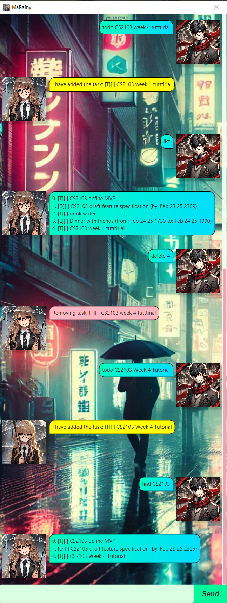

# Msrainy User Guide

## Introduction

Msrainy is a task management application designed to help you stay organized by keeping track of various tasks. It allows you to create different types of tasks, mark or unmark their completion status, search through your tasks, and automatically saves your progress to a text file.



## Adding Tasks

Msrainy supports adding three types of tasks:

- **Todo**: A simple task with no deadline.
- **Deadline**: A task that has a specific deadline.
- **Event**: A task associated with a particular duration of time.

### Example Usage

```plaintext
todo Finish homework
deadline Submit assignment /by 28/02/25 1201
event Project meeting /from 01/03/25 1200 /to 01/03/25 1400
```

### Expected Output

```plaintext
I have added the task: [T][ ] Finish homework
I have added the task: [D][ ] Submit assignment (by: Feb 28 25 1201)
I have added the task: [E][ ] Project meeting (from: March 01 25 1200 to: March 01 25 1400)
```

## Mark, Unmark, and Delete Tasks

You can update the status of tasks or remove them entirely.

### Example Usage

```plaintext
mark 1
unmark 1
delete 2
```

### Expected Output

```plaintext
Finish homework has been updated:
[T][X] Finish homework
Finish homework has been updated:
[T][ ] Finish homework
Unmarked task as not done: [T][ ] Finish homework
Removing task: [T][ ] Finish homework
```

## List All Tasks

Displays all tasks currently in the task list.

### Example Usage

```plaintext
list
```

### Expected Output

```plaintext
0. [T][X] Finish homework
1. [D][ ] Submit assignment (by: Feb 28 25 1201)
2. [E][ ] Project meeting (from: March 01 25 1200 to: March 01 25 1400)
```

## Search Tasks by Keyword

Find tasks that contain a specific keyword.

### Example Usage

```plaintext
find homework
```

### Expected Output

```plaintext
0. [T][X] Finish homework
```